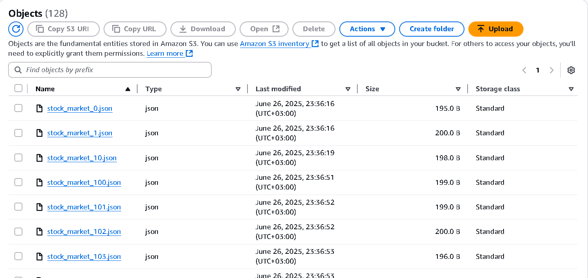

# 📊 Real-Time Stock Market Data Pipeline


## 🎯 Project Overview

This project demonstrates a comprehensive **end-to-end data engineering pipeline** for real-time stock market data processing. The system seamlessly integrates Apache Kafka with AWS cloud services to provide scalable, real-time analytics capabilities for financial data streams.

## 🏗️ Architecture Components

The pipeline consists of the following key components:

- **Data Source**: Stock market data generator with realistic trading information
- **Apache Kafka**: High-throughput message streaming platform
- **EC2 Instance**: Hosts Kafka broker and ZooKeeper services
- **Python Applications**: Producer and consumer services for data ingestion
- **AWS S3**: Scalable object storage for data lake architecture  
- **AWS Glue**: Automated schema discovery and data cataloging
- **AWS Athena**: Serverless SQL analytics engine

## 📈 Real-Time Data Flow in S3

The pipeline continuously streams stock market data into AWS S3 with the following characteristics:

### Data Storage Pattern
```
s3://stock-market-realtime-kafka/
├── stock_market_20250629_143616_a1b2c3d4.json
├── stock_market_20250629_143617_e5f6g7h8.json
├── stock_market_20250629_143618_i9j0k1l2.json
└── ...
```

### Sample Data Structure
Each JSON file contains real-time stock information:
```json
{
  "symbol": "AAPL",
  "price": 150.25,
  "volume": 1000000,
  "timestamp": "2025-06-29T14:36:16.123456",
  "market_cap": 2500000000,
  "pe_ratio": 28.5
}
```

### Data Ingestion Statistics
- **Frequency**: 1 record per second per stock symbol
- **File Size**: ~195-200 bytes per JSON file
- **Storage Class**: Standard (with lifecycle policies recommended)
- **Retention**: Configurable based on business requirements

## 🚀 Key Features

- ⚡ **Real-Time Processing**: Sub-second latency data streaming
- 🔄 **Fault Tolerance**: Kafka's built-in replication and durability
- 📊 **Scalable Storage**: AWS S3 for unlimited data retention
- 🔍 **SQL Analytics**: Query data using familiar SQL syntax
- 🛡️ **Security**: IAM-based access control and encryption
- 📈 **Monitoring**: CloudWatch integration for system health

## 🛠️ Technology Stack

| Component | Technology | Purpose |
|-----------|------------|---------|
| **Message Streaming** | Apache Kafka 3.3.1 | Real-time data ingestion |
| **Compute** | AWS EC2 | Infrastructure hosting |
| **Storage** | AWS S3 | Data lake storage |
| **Processing** | Python 3.8+ | Data transformation |
| **Analytics** | AWS Athena | SQL-based querying |
| **Cataloging** | AWS Glue | Schema management |

## 📋 Prerequisites

- AWS Account with appropriate permissions
- EC2 instance (t2.micro or larger)
- Python 3.8+ environment
- Basic knowledge of Kafka and AWS services

## 🚦 Quick Start

1. **Clone and Setup**
   ```bash
   git clone <repository-url>
   cd stock-market-pipeline
   pip install -r requirements.txt
   ```

2. **Configure AWS Credentials**
   ```bash
   aws configure
   # Enter your access key, secret key, and region
   ```

3. **Start Kafka Services**
   ```bash
   # Terminal 1: Start ZooKeeper
   bin/zookeeper-server-start.sh config/zookeeper.properties
   
   # Terminal 2: Start Kafka Broker
   bin/kafka-server-start.sh config/server.properties
   ```

4. **Run Data Pipeline**
   ```bash
   # Terminal 3: Start Producer
   python producer.py
   
   # Terminal 4: Start Consumer
   python consumer.py
   ```

## 📊 Data Analytics Examples

Once data is flowing into S3 and cataloged by Glue, you can run analytics queries:

```sql
-- Top performing stocks by average price
SELECT 
    symbol, 
    AVG(price) as avg_price,
    COUNT(*) as total_records
FROM stock_database.stock_market_realtime_kafka
GROUP BY symbol
ORDER BY avg_price DESC
LIMIT 10;

-- Real-time volume analysis
SELECT 
    symbol,
    SUM(volume) as total_volume,
    MAX(timestamp) as latest_update
FROM stock_database.stock_market_realtime_kafka
WHERE DATE(timestamp) = CURRENT_DATE
GROUP BY symbol
ORDER BY total_volume DESC;
```

## 🔧 Configuration Options

### Kafka Producer Settings
- **Batch Size**: 16384 bytes for optimal throughput
- **Linger Time**: 10ms for low-latency delivery
- **Retries**: 3 attempts for fault tolerance

### S3 Storage Options

- **Bucket**: `stock-market-realtime-kafka`
- **File Format**: JSON (easily readable and queryable)
- **Naming Convention**: `stock_market_{timestamp}_{uuid}.json`

## 📈 Monitoring and Metrics

The pipeline provides several monitoring capabilities:

- **Kafka Metrics**: Producer/consumer lag, throughput rates
- **S3 Metrics**: Object count, storage utilization
- **System Metrics**: EC2 CPU, memory, and network usage
- **Custom Metrics**: Data quality and processing latencies

## 🛡️ Security Best Practices

- Use IAM roles instead of hardcoded credentials
- Enable S3 bucket encryption at rest
- Configure VPC security groups for EC2 access
- Implement least-privilege access policies
- Enable CloudTrail for audit logging

## 🔮 Future Enhancements

- **Stream Processing**: Add Apache Spark for complex analytics
- **Machine Learning**: Integrate SageMaker for predictive modeling
- **Visualization**: Connect to QuickSight for dashboards
- **Alerting**: Implement SNS notifications for anomalies
- **Multi-Region**: Deploy across multiple AWS regions

## 📚 Additional Resources

- [Apache Kafka Documentation](https://kafka.apache.org/documentation/)
- [AWS S3 Developer Guide](https://docs.aws.amazon.com/s3/)
- [AWS Glue User Guide](https://docs.aws.amazon.com/glue/)
- [AWS Athena User Guide](https://docs.aws.amazon.com/athena/)

## 🤝 Contributing

Contributions are welcome! Please feel free to submit pull requests, report bugs, or suggest new features.

## 📄 License

This project is licensed under the MIT License - see the [LICENSE](LICENSE) file for details.

---

## 🙏 Acknowledgments

Thank you for exploring this Real-Time Stock Market Data Pipeline project! This implementation demonstrates modern data engineering practices using industry-standard tools and cloud services. 

The project showcases how to build scalable, fault-tolerant data pipelines that can handle high-volume financial data streams while providing real-time analytics capabilities.

### 🔗 Connect with Me

I'd love to connect and discuss data engineering, cloud architecture, and real-time analytics!

[](https://www.linkedin.com/in/mustafa-rezk-/)

---

*Built with ❤️ for the data engineering community*
